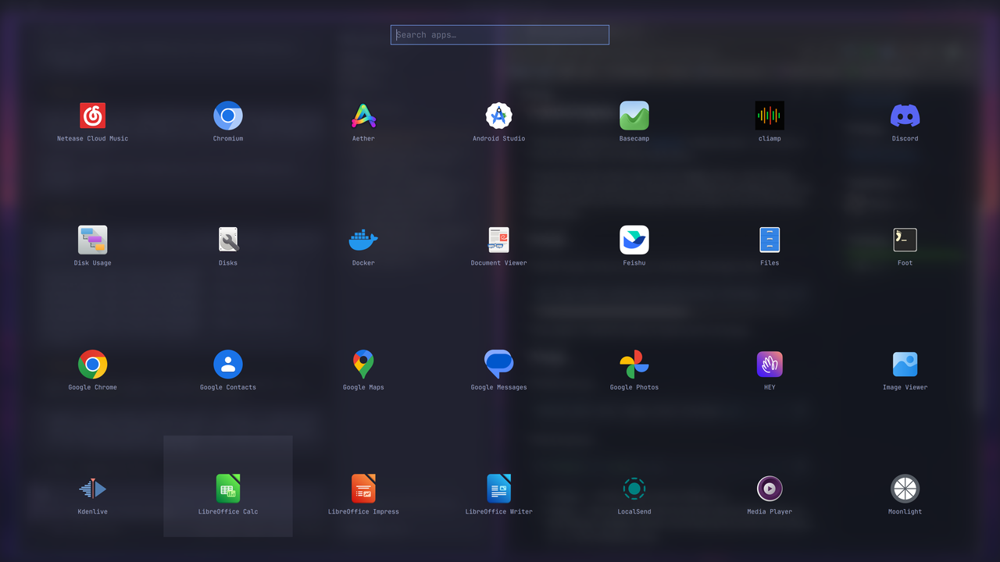

# Launchpad



A full-screen application grid for [Omarchy](https://omarchy.org/)'s `omarchy-shell`, in the style of macOS Launchpad / the Ubuntu app drawer.

The grid mirrors the Super+Space menu's **Apps** section: same desktop-entry source, same fuzzy sort, and the same hidden-entry filtering. A first row surfaces recently and most-frequently launched apps; the rest of the library follows below.

## Install

```sh
omarchy plugin add https://github.com/xechoz/xechoz.launchpad --enable --yes
```

Reload the shell if the pad does not appear right away:

```sh
omarchy-shell shell rescanPlugins
```

Then bind it in your Hyprland config, for example:

```
bind = SUPER, space, exec, omarchy-shell shell toggle xechoz.launchpad '{}'
```

## Usage

```sh
omarchy-shell shell toggle xechoz.launchpad '{}'
```

Optional payload:

```json
{ "columns": 7, "recent": 4 }
```

- `columns` — number of grid columns (default `7`).
- `recent` — how many of the first row are the newest distinct apps; the row is filled to `columns` with the most frequently launched ones (default `-1`, i.e. fill by frequency only).

Left-click an app to launch it, right-click to uninstall it. `Esc` clears the search, then closes the pad; `Super+A` also closes it while open (the pad holds exclusive keyboard focus, so Hyprland never sees the key).

Launch counts are tracked locally while the pad is open and persisted to `~/.local/state/omarchy/launchpad-usage.json`.

## How it works

- **Overlay plugin.** The manifest declares `overlay` (plus `menu`) and the plugin draws its own full-screen `PanelWindow` on the overlay layer with exclusive keyboard focus.
- **Application data.** `omarchy-shell` normally injects a shared application library as `shell.appLibrary`. Third-party overlay/panel/menu plugins currently receive a null `appLibrary` — the host's `Instantiator` converts the manifest's `kinds` array to a `V4Sequence`, so its `Array.isArray()` kind check fails — so Launchpad falls back to `LocalAppLibrary.qml`, a drop-in replica of the shell's library with the same public surface. When the official library is available it is preferred automatically and the fallback is never called.
- **Frosted backdrop.** Hyprland's layer blur is gated behind the globally-disabled `decoration:blur:enabled`, so the plugin grabs the screen with `grim` and blurs the bitmap itself. The window stays hidden until the frame is ready.

## Requirements

- Omarchy with `omarchy-shell` (Quickshell).
- `grim` and `uwsm` on `PATH` (both ship with Omarchy).

## Files

- `Launchpad.qml` — the plugin entry point (UI, lifecycle, blur, usage tracking).
- `LocalAppLibrary.qml` — local fallback for `shell.appLibrary`.
- `manifest.json` — Omarchy plugin manifest (`overlay` + `menu` entry points, `keepLoaded`).
- `LICENSE` — MIT.
